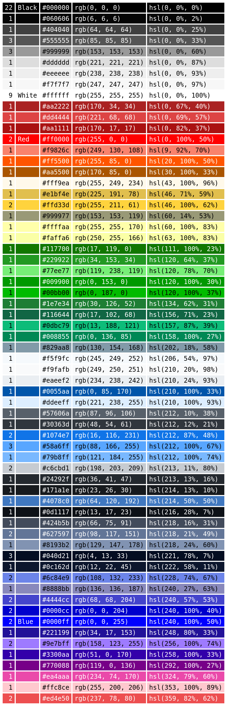

# csscolors
Script to extract color codes from CSS of websites.

No third-party dependencies.

## Usage
~~~
usage: csscolors.py [-h] [--html-output] [--sort-by {rgb,hsv,occ}] URL

positional arguments:
  URL

options:
  -h, --help            show this help message and exit
  --html-output         render colors as HTML table
  --sort-by {rgb,hsv,occ}
                        sort colors by rgb value (default), hsv value or occurrence
~~~

### Example

~~~
$ ./csscolors.py --html-output --sort-by hsv https://github.com > example/github-colors.html
$ more example/github-colors.html
<!doctype html>
<html><head><title>https://github.com</title></head>
<body><table style="font-family: monospace">
<tr><td style="background-color: #060606"> #060606 </td><td> (6, 6, 6) </td></tr>
<tr><td style="background-color: #404040"> #404040 </td><td> (64, 64, 64) </td></tr>
<tr><td style="background-color: #b5b5b5"> #b5b5b5 </td><td> (181, 181, 181) </td></tr>
<tr><td style="background-color: #dcdcdc"> #dcdcdc </td><td> (220, 220, 220) </td></tr>
<tr><td style="background-color: #f7f7f7"> #f7f7f7 </td><td> (247, 247, 247) </td></tr>
<tr><td style="background-color: #f9826c"> #f9826c </td><td> (249, 130, 108) </td></tr>
--More--
~~~

